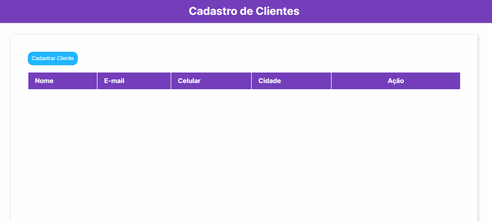
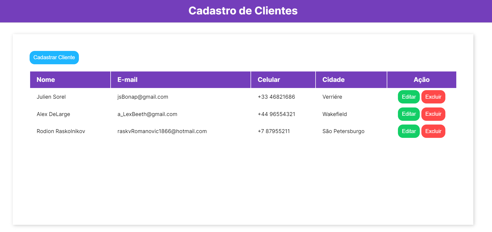
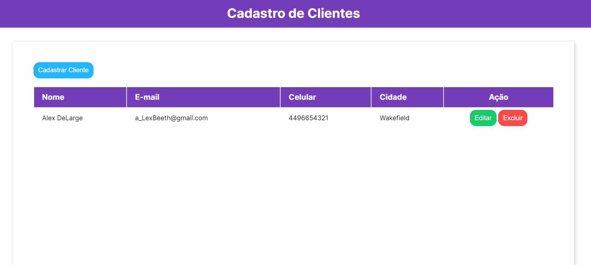

<h1 align="center">Projeto Cadastro de Clientes (CRUD)</h1>

Neste pequeno projeto temos uma simulação de um sistema de cadastro de clientes no qual podemos registrar os seus dados, bem como vizualizá-los no bloco do sistema, atualizá-los (modificá-los) e deletá-los. Abaixo temos uma apresentação de cada funcionalidade.

<h3>✍️ C.reate/Cadastrar</h3>

<h3>👀 R.ead/Visualizar</h3>

<h3>✨ U.pdate/Atualizar</h3>

<h3>🚮 D.elete/Deletar</h3>

<h3>📱 Mobile</h3>

  

Com este projeto vejo que pude explorar as formas de se aplicar as funcionalidades do <i>localStorage</i> e desenvolver as minhas habilidades com JavaScript puro.

<h3>🛠️ Tecnologias</h3>

- HTML
- CSS
- JavaScript

<h3>Links</h3>

- Page: [Cadastro de Clientes](https://markshenrik.github.io/cadastro-de-clientes/)

- LinkedIn: [Marks Henrik](https://www.linkedin.com/in/markshenrik/)
